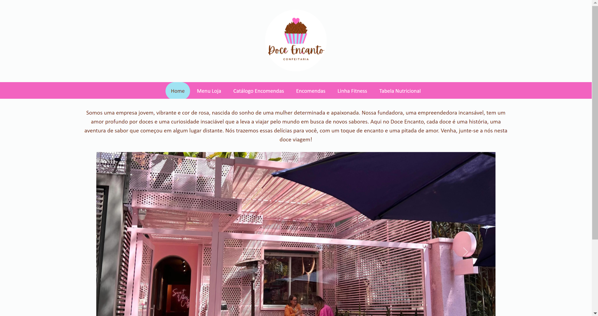

<h1>Site com Bootstrap.</h1>

3 páginas html:
- index.html
- menu.html.
- catalogo-encomendas.html
- encomendas.html
- linha-fitness.html
- tabela-nutricional.html

1 pasta css:
- index.css
- menu.css
- cataloog-encomendas.css
- encoemndas.css
- linha-fitness.css
- tabela-nutricional.css
- topnave.css

1 pasta JS:
- topnav.js

 

 <h2>Página Index</h2>
  
 
 
  <h2>Página Menu Loja</h2>
  
  

   
  
  <h2>Página Catálogo Encomendas</h2>
  
  
  
  
  
   
  
  <h2>Página Encomendas</h2>
  
  
  
   
  
  <h2>Página Linha Fitness</h2>
  
  
  
   

  <h2>Página Tabela Nutricional</h2>
  
  
  
